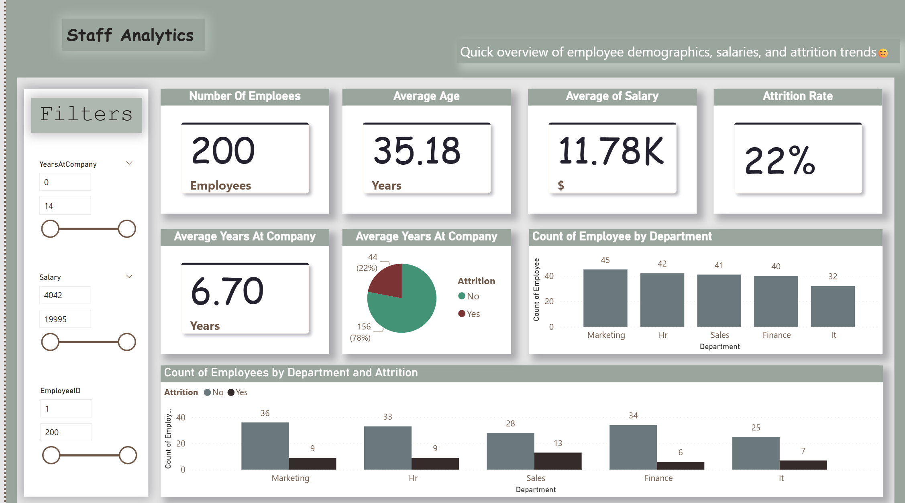

# Employee Overview

## Description
This project contains an HR data analysis report. The dataset was cleaned and preprocessed using Python, and exploratory data analysis (EDA) was performed to uncover insights. An interactive Power BI dashboard was created to help HR teams monitor key metrics and trends, including Age, Department, Salary, Years at Company, and Attrition status.

## Files
- `HR_Analytics.pbix` : Power BI report file
- `data_hr_c.py` : Python script for cleaning and preprocessing the data
- `HR_data_cleaned.csv` : Cleaned dataset
- `Screenshot 2025-11-30 040717.png` : Screenshot of the report

## How to Use
1. Open the `data_hr_c.py` script in Python.
2. Run the script to clean and preprocess your HR dataset.
3. Save the cleaned dataset as `HR_data_cleaned.csv`.
4. Open `HR_Analytics.pbix` in Power BI Desktop.
5. Load the cleaned dataset (`HR_data_cleaned.csv`) into Power BI.
6. Explore the report using interactive visuals and filters.
7. Check dashboards for insights such as employee distribution, salary trends, and attrition patterns.

## Skills & Technologies
- Python (Data Cleaning & Preprocessing)
- Exploratory Data Analysis (EDA)
- Power BI (Dashboards & Reporting)
- Excel (optional)
- Data Visualization
- HR Analytics

## Key Insights
- Employee distribution by department and age
- Salary trends across roles and tenure
- Attrition patterns and risk analysis

## Screenshots

## Author
Khaled Lotfy
